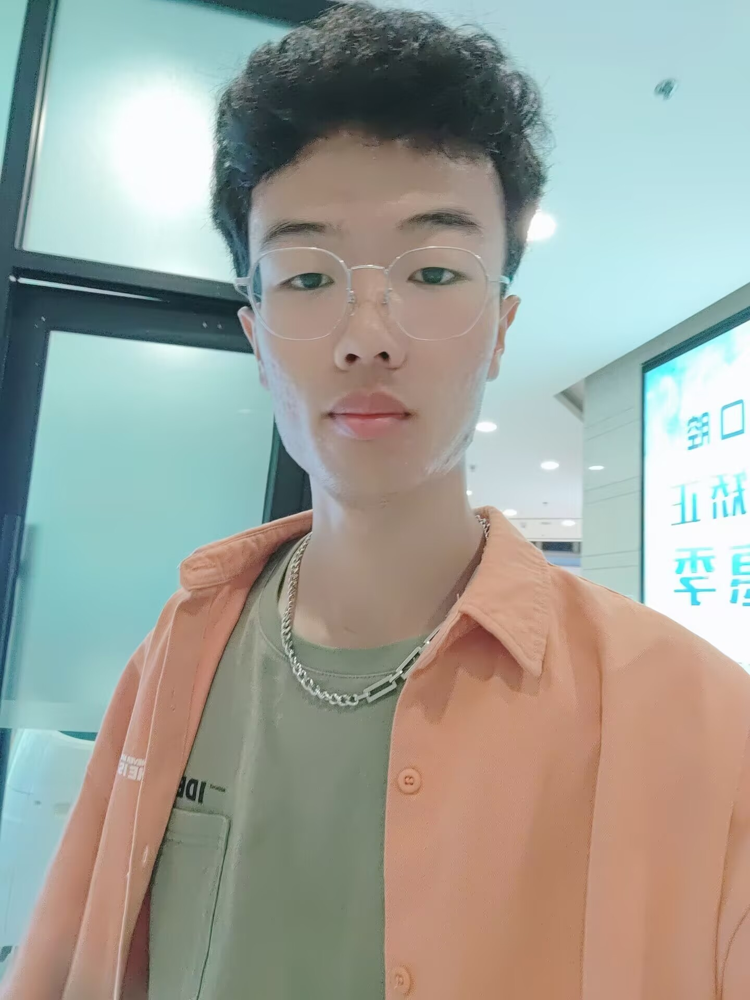

<html lang="zh-CN">
<head>
    <meta charset="UTF-8">
    <meta name="viewport" content="width=device-width, initial-scale=1.0">
    <title>个人简历</title>
    
</head>
<body>
    
个人简历

    
<caption>基本信息</caption>

    <table class="resume-table">
        <tr>
            <th>姓名</th>
            <td>张三</td>
            <th>性别</th>
            <td>男</td>
            <th rowspan="4">照片</th>
            <td rowspan="4" class="photo-cell">
                
            </td>
        </tr>
        <tr>
            <th>年龄</th>
            <td>28</td>
            <th>籍贯</th>
            <td>北京</td>
        </tr>
        <tr>
            <th>联系电话</th>
            <td>138-1234-5678</td>
            <th>电子邮箱</th>
            <td>zhangsan@example.com</td>
        </tr>
        <tr>
            <th>学历</th>
            <td>硕士</td>
            <th>婚姻状况</th>
            <td>未婚</td>
        </tr>
        <tr>
            <th>健康状况</th>
            <td>良好</td>
            <th>求职意向</th>
            <td colspan="3">Web前端开发工程师</td>
        </tr>
        <tr>
            <th>专业</th>
            <td>计算机科学与技术</td>
            <th>毕业院校</th>
            <td colspan="3">清华大学</td>
        </tr>
    </table>

    
技能证书

    

        
• Web前端开发工程师证书（高级）

        
• 英语六级（CET-6）

        
• 计算机技术与软件专业技术资格（中级）

        
• 熟练掌握HTML5, CSS3, JavaScript, Vue.js, React等前端技术

    

    
个人特长与爱好

    

        
• 擅长前端性能优化和用户体验设计

        
• 热爱开源技术，GitHub上有多个个人项目

        
• 喜欢篮球、游泳等体育运动

        
• 对摄影和平面设计有浓厚兴趣

    

    
项目经历

    

        
<strong>项目一：企业ERP管理系统（2020-2021）</strong>

        
• 负责前端架构设计和核心模块开发

        
• 使用Vue.js + Element UI实现响应式界面

        
• 优化页面加载速度，性能提升40%

        
        
<strong>项目二：电商平台前端重构（2019-2020）</strong>

        
• 主导从jQuery到Vue.js的技术迁移

        
• 实现组件化开发，代码复用率提高60%

        
• 引入Webpack优化构建流程

        
        
<strong>项目三：移动端H5应用开发（2018-2019）</strong>

        
• 使用React Native开发跨平台应用

        
• 实现高性能动画效果，FPS稳定在60帧

        
• 获公司年度最佳项目奖

    

    
自我评价

    

        
本人具有5年前端开发经验，技术全面，对前端工程化有深入理解。工作认真负责，善于沟通协作，能够承受工作压力。具备良好的代码习惯和文档编写能力，追求极致的用户体验。热爱学习新技术，保持技术敏感度，定期参与技术社区活动。

        
在项目中注重代码质量和开发效率，能够快速理解业务需求并转化为技术方案。对前端性能优化、跨平台开发和可视化有丰富经验。曾带领5人前端团队完成多个大型项目开发，具备较强的解决问题能力和团队领导能力。

        
职业目标是成为全栈技术专家，在提升个人技术深度的同时，培养团队管理能力，为公司创造更大价值。目前正在学习Node.js后端开发和微服务架构，以拓展技术广度。

    

</body>
</html>
